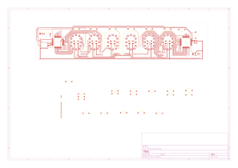

# Nixie Clock Driver (Doayee IN-12B)

A 6-digit IN-12B Nixie tube display and driver board designed in KiCad.



---

## Overview

This project is a modular Nixie tube driver board tailored for Russian **IN-12B** cold-cathode neon display tubes. It utilizes the **HV5122PG** high-voltage 32-channel shift register IC to drive tube cathodes with minimal microcontroller I/O pins, paired with individually driven RGB backlights underneath each tube.

### Key Features
* **6x IN-12B Nixie Tube Sockets**: DSUB-style footprint mounting with decimal point support.
* **Microchip/Supertex HV5122PG High-Voltage Driver**: 32 high-voltage open-drain outputs with internal shift register and latch.
* **RGB Tube Backlighting**: Dedicated Cree PLCC4 / SMD RGB LEDs for under-glow effects.
* **Integrated Logic**: 74LVC1G79 D-type flip-flop for high-speed clock/data synchronization.
* **Self-Contained Library Management**: All custom symbols, footprints, and 3D models are bundled in the repository and mapped via relative project variables (`${KIPRJMOD}`).

---

## Repository Structure

```
├── Nixie.kicad_pro              # KiCad project file
├── Nixie.kicad_sch              # Main schematic
├── Nixie.kicad_pcb              # PCB layout
├── sym-lib-table                # Project symbol library table (portable ${KIPRJMOD})
├── fp-lib-table                 # Project footprint library table (portable ${KIPRJMOD})
├── libs/                        # Bundled component libraries
│   ├── symbols/                 # Symbol libraries (.kicad_sym)
│   │   ├── HV5122_Doayee.kicad_sym
│   │   ├── HV5122PG-G.kicad_sym
│   │   ├── 74LVC1G79GW-Q100H.kicad_sym
│   │   ├── nixies-us.kicad_sym
│   │   ├── mynixies.kicad_sym
│   │   ├── nixiemisc.kicad_sym
│   │   └── CustomComponents.kicad_sym
│   ├── footprints/              # Footprint libraries (.pretty folders)
│   │   ├── HV5122PG-G.pretty/
│   │   ├── 74LVC1G79GW.pretty/
│   │   ├── nixies-us.pretty/
│   │   ├── mynixies.pretty/
│   │   ├── nixiemisc.pretty/
│   │   └── CustomComponents.pretty/
│   └── 3dmodels/                # 3D models (.wrl / .step)
│       └── IN-12B.wrl, box_header_*.wrl
├── datasheets/                  # Component datasheets (IN-12B, HV5122, etc.)
├── production/                  # Manufacturing outputs
│   └── gerbers/                 # Gerbers and drill files
├── docs/                        # Exported documentation
│   ├── schematic.pdf            # Schematic in PDF format
│   └── pcb_top.svg              # Top-layer SVG rendering
└── archive/                     # Historical KiCad 4/5 files
    └── legacy_kicad4/
```

---

## How to Open in KiCad

1. Clone this repository:
   ```bash
   git clone git@github.com:meirtolpin11/Nixie-Clock-Doayee.git
   ```
2. Open **KiCad** (version 7, 8, 9, or 10).
3. Select **File -> Open Project...** and select `Nixie.kicad_pro`.
4. All symbols and footprints are pre-configured to resolve automatically using `${KIPRJMOD}`—no manual library configuration is needed.

---

## Documentation & Exports

* **Schematic PDF**: [docs/schematic.pdf](docs/schematic.pdf)
* **Gerber Files**: [production/gerbers/](production/gerbers/)
* **Datasheets**: [datasheets/](datasheets/)

---

## License

Hardware design and files are provided for personal and open-source hobbyist use.
